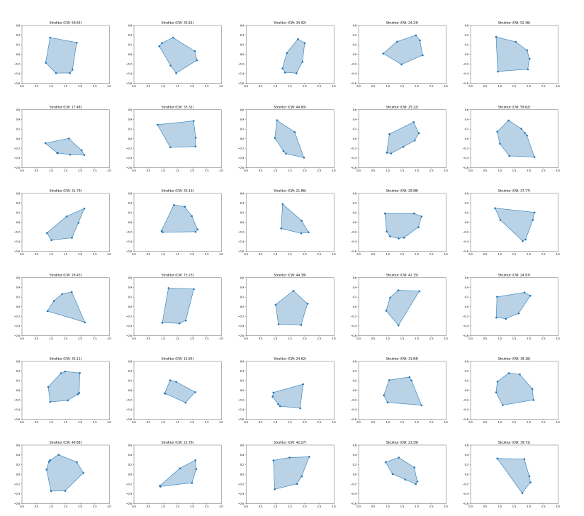
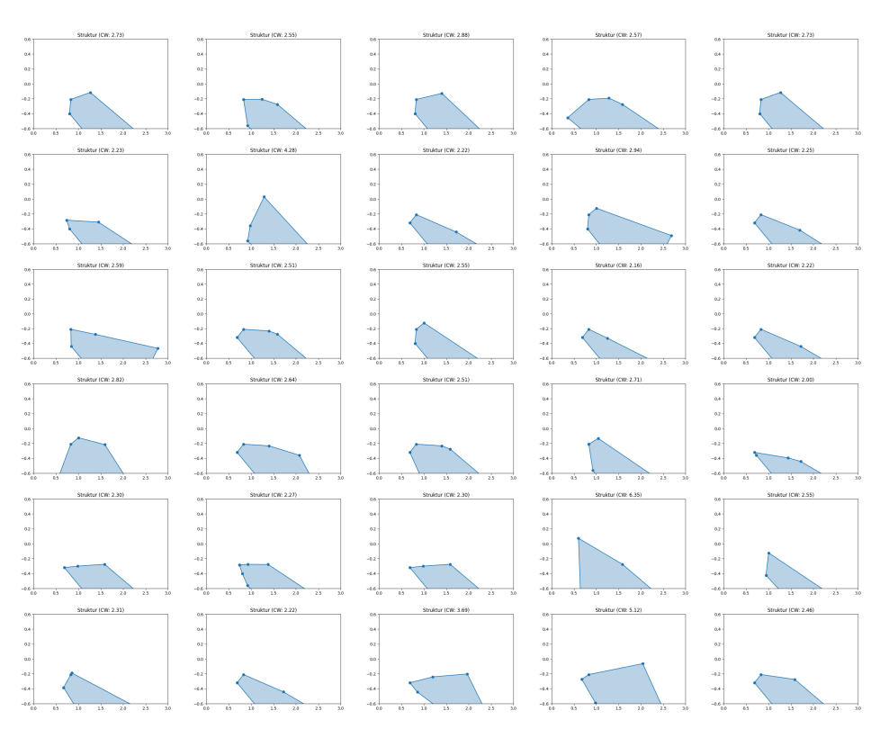
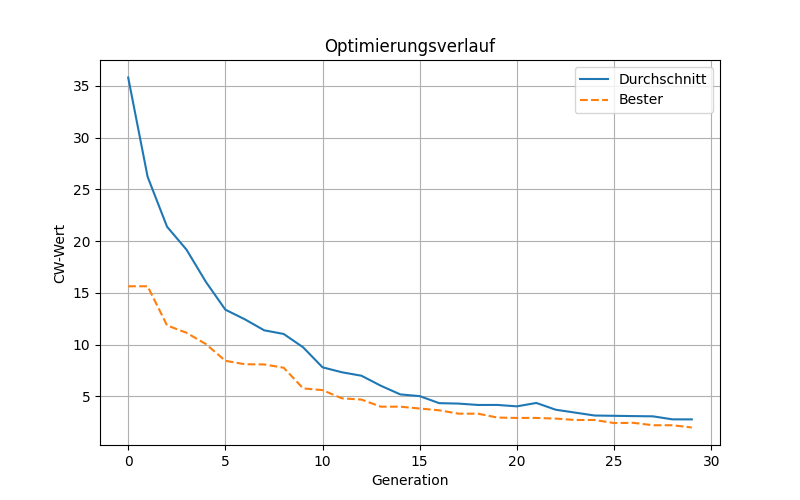
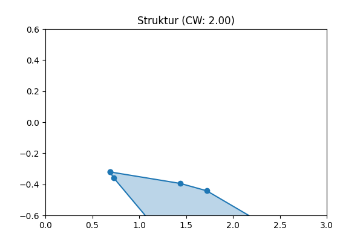
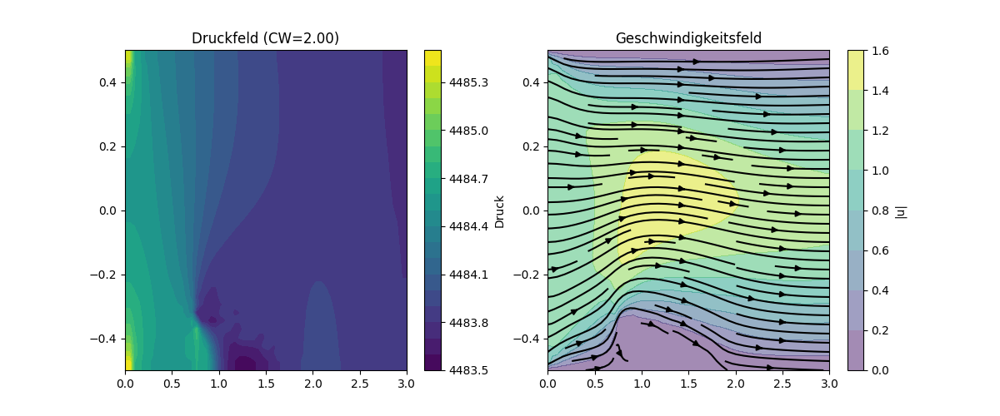

# Background of the Project
This project is part of my son Nick’s school-paper on the topic of mobility. His idea was to optimize the drag coefficient of vehicles. Together, we implemented a simplified two-dimensional model along with a relatively straightforward flow simulation.
The simulation is embedded in an optimization loop using an evolutionary algorithm. The idea is to optimize the structure of a simple 2-D form. The objective funtion is the drag-coefficient.

School: https://www.igs-wallstrasse.de/index.php/oberstufe

# Requirements and Usage

Python usage via https://github.com/astral-sh/uv.

Just install **uv**. **uv** downloads all required dependencies.

- Starting the optimization loop with 30 iterations run:
```
uv run drag_opt_fdm_chatgpt_8points_pop20_convex_structure_point_in_polygon.py
```

- Visualization of the simulation model:
```
uv run plot_channel.py
```

- Visualization of the convex hull example:
```
uv run plot_polygon.py
```

# Optimization
You can find the results of a sample optimization run using a population size of 30 and running over 30 iterations in the folder **results**.

## Initial Population


## Final Population


## Results of the Optimiation Process


## Best Individual





